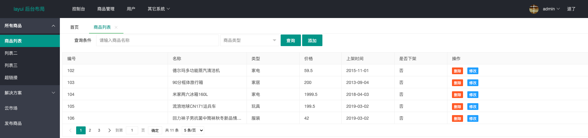

# Layui-admin + Ajax实现商品的CRUD操作

## 一、基本操作步骤

第一：创建Web项目 - 基于Git

1）创建空的远程仓库

- 设置仓库组员
- 设置分支及权限


2）使用IDEA创建项目

- 忽略文件
- README.md


3）各个组员克隆远程仓库中的项目，进行相关的开发


第二：编写前端页面（HTML、CSS、JS、JQ）


第三：编写后端程序

 1、创建数据库及相关的数据表

```mssql
create table ...
```


2、编写实体对象

> 作用：封装数据、数据传递

**命名规范：xxx.xxx.entity.XxxXxx**


3、编写DAO接口

> DAO（Data Access Object） : 数据访问对象 - 操作数据库(CRUD) - 服务于业务

**命名规范：xxx.xxx.dao.XxxXxxDao**


4、编写DAO接口实现类 **命名规范：xxx.xxx.dao.impl.XxxXxxDaoImpl**


5、编写业务(Service)接口 **命名规范：xxx.xxx.service.XxxXxxService**


6、编写业务(Service)接口的实现类 **命名规范：xxx.xxx.service.impl.XxxXxxServiceImpl**


7、编写Servlet（控制中心，建立前端页面和后台程序之间的联系）

**注意：在实际开发中，以上步骤不是固定不变的，而是灵活运用。**


## 二、数据库

```mysql
create database layui_admin ;

use layui_admin ;

-- 管理员用户
CREATE TABLE IF NOT EXISTS `user`
(
	`id` int AUTO_INCREMENT primary key not null ,
	`username` varchar(20) unique not null ,
	`password` char(32) not null ,
	`level` varchar(10) default '管理员' ,
	`image` varchar(50) default 'default.jpg',
	`phone` varchar(20) ,
	`reg_time` datetime default now(),
	`status` int default 1
);

-- 初始化数据
insert into `user` (`username`,`password`,`level`,`image`,`phone`) 
values ('admin','21232F297A57A5A743894A0E4A801FC3','超级管理员',default,13417747371);


-- 产品信息表
create table product
(
  	product_id varchar(50) primary key not null ,						-- 产品编号
  	product_name varchar(50) not null,											-- 产品名称
		product_type varchar(50) not null,											-- 产品类型
  	product_price float not null,														-- 产品价格
  	product_count int not null default 1,										-- 产品库存
  	product_image varchar(50) default 'default.jpeg',				-- 产品图片
  	product_date datetime default now(),										-- 上货日期
  	product_desc varchar(200) default '暂无描述',							-- 描述
  	product_sale int,																				-- 销量
  	product_status int																			-- 是否上架
) ;


-- 初始化数据
insert into product(product_id,product_name,product_type,product_price,product_count,product_image,product_date,product_desc,product_sale,product_status) 
values ('101','米家智能插座WIFI版','家电',39.5,100,'101.png','2013-01-07','101..',100,1) ;

insert into product(product_id,product_name,product_type,product_price,product_count,product_image,product_date,product_desc,product_sale,product_status)  
	values ('102','德尔玛多功能蒸汽清洁机','家电',59.5,100,'102.png','2015-11-01','102..',200,1) ;

insert into product(product_id,product_name,product_type,product_price,product_count,product_image,product_date,product_desc,product_sale,product_status)  
	values ('103','90分框体旅行箱','家居',200,100,'103.png','2013-09-04','103..',300,1) ;

insert into product(product_id,product_name,product_type,product_price,product_count,product_image,product_date,product_desc,product_sale,product_status)  
	values ('104','米家两六冰箱160L','家电',1999.5,100,'104.png','2018-04-03','104..',400,1) ;

insert into product(product_id,product_name,product_type,product_price,product_count,product_image,product_date,product_desc,product_sale,product_status)  
	values ('105','流浪地球CN171运兵车','玩具',199.5,100,'105.png','2019-03-02','105..',500,1) ;

insert into product(product_id,product_name,product_type,product_price,product_count,product_image,product_date,product_desc,product_sale,product_status)   
	values ('106','回力袜子男抗菌中筒袜秋冬新品情侣款','服装',42,100,'106.jpeg','2019-03-02','106..',500,1) ;
	
insert into product(product_id,product_name,product_type,product_price,product_count,product_image,product_date,product_desc,product_sale,product_status)  
	values ('107','周生生水波纹手链','首饰',1629,100,'107.jpeg','2017-06-14','107..',500,1) ;

insert into product(product_id,product_name,product_type,product_price,product_count,product_image,product_date,product_desc,product_sale,product_status)   
	values ('108','腾讯视频年卡+京东PLUS会员','硬件',148,100,'108.png','2019-06-24','108..',500,1) ;

insert into product(product_id,product_name,product_type,product_price,product_count,product_image,product_date,product_desc,product_sale,product_status)  
	values ('109','Dyson戴森 手持无线吸尘器 V7','家电',1199,100,'109.jpeg','2013-05-22','109..',500,1) ;

insert into product(product_id,product_name,product_type,product_price,product_count,product_image,product_date,product_desc,product_sale,product_status)  
	values ('110','京东京造 哥窑自动茶具套装','家居',519,100,'110.jpeg','2018-05-08','110..',500,1) ;

insert into product(product_id,product_name,product_type,product_price,product_count,product_image,product_date,product_desc,product_sale,product_status)  
	values ('112','鸭鸭佟丽娅同款工装羽绒服','服装',699,100,'112.jpeg','2022-11-02','112..',500,1) ;

insert into product(product_id,product_name,product_type,product_price,product_count,product_image,product_date,product_desc,product_sale,product_status)  
	values ('113','JBL T115TWS真无线耳机','家电',168,100,'113.jpeg','2022-01-01','113..',500,1) ;

insert into product(product_id,product_name,product_type,product_price,product_count,product_image,product_date,product_desc,product_sale,product_status)  
	values ('114','玖合 256GB SATA3 SSD固态硬盘','硬件',96,100,'114.jpeg','2012-12-12','114..',500,1) ;
	
-- 分类信息表
create table product_type
(
  	type_id int auto_increment primary key ,					 -- 商品分类编号
  	type_name varchar(50) not null,											-- 商品分类名称
		parent_id int																					-- 你分类编号
) ;

insert into product_type(type_name,parent_id) values ('家电',0) ;
insert into product_type(type_name,parent_id) values ('家居',0) ;
insert into product_type(type_name,parent_id) values ('玩具',0) ;
insert into product_type(type_name,parent_id) values ('服装',0) ;
insert into product_type(type_name,parent_id) values ('首饰',0) ;
insert into product_type(type_name,parent_id) values ('硬件',0) ;

select * from product_type;
```


**效果如下图所示：**




## 三、工具类

### 1、DBUtil


### 2、GsonUtil


### 3、Md5Util


### 4、UuidUtil


### 5、FileUploadUtil


### 6、JwtUtil


## 四、过滤器

### 1、EncodingFilter


### 2、AuthorityFilter


## 五、Servlet实现

### 1、ErrorTips

```java
/**
 * 错误提示
 *
 */
public class ErrorTips {
    /**
     * 错误的消息
     */
    private String msg;

    /**
     * 错误返回地址
     */
    private String url;

    /**
     * 文本提示
     */
    private String tips;
 
  	// ....
}
```


### 2、ResponseData

```java
/**
 * 封装服务器响应的数据 - 统一 API 接口
 *
 */
public class ResponseData {
    /**
     *  响应代码（如：200、500、或其它根据业务自定义代码）
     */
    private Integer code ;
    /**
     * 响应信息
     */
    private String msg ;
    /**
     * 响应的数据
     */
    private Object data ;

    public ResponseData(){}

    public ResponseData(Integer code, String msg, Object data) {
        this.code = code;
        this.msg = msg;
        this.data = data;
    }
  
  	//...
}
```


### 3、PageVo

```java
/**
 * 分页 - layui - 动态表格 - 分页
 *
 */
public class PageVo extends ResponseData {
    /**
     * 总记录数
     */
    private Long count;

    public Long getCount() {
        return count;
    }

    public void setCount(Long count) {
        this.count = count;
    }
}
```


### 4、BaseServlet

```java
public class BaseServlet extends HttpServlet {
    private static final long serialVersionUID = 1L;

    /**
     * 封装错误提示
     *
     * @param msg
     * @param url
     * @param req
     * @param resp
     * @throws ServletException
     * @throws IOException
     */
    protected void error(String msg, String url, HttpServletRequest req, 
                         HttpServletResponse resp)
            throws ServletException, IOException {
        this.error(msg, url, "返回", req, resp);
    }

    /**
     * 封装错误提示
     *
     * @param msg
     * @param url
     * @param tips
     * @param req
     * @param resp
     * @throws ServletException
     * @throws IOException
     */
    protected void error(String msg, String url, String tips, HttpServletRequest req, 
                         HttpServletResponse resp)
            throws ServletException, IOException {
        ErrorTips error = new ErrorTips(msg, url, tips);
        req.setAttribute("error", error);
        req.getRequestDispatcher("/WEB-INF/jsp/error.jsp").forward(req, resp);
    }


    /**
     * 成功响应的封装 - 默认
     *
     * @return
     */
    public ResponseData successJson(Object data) {
        return new ResponseData(200, "", data);
    }

    /**
     * 重载方法 - 封装所有的成功响应信息
     *
     * @param code
     * @param msg
     * @param data
     * @return
     */
    public ResponseData successJson(Integer code, String msg, Object data) {
        return new ResponseData(code, msg, data);
    }

    /**
     * 错误响应的封装 - 默认
     *
     * @param msg
     * @return
     */
    public ResponseData errorJson(String msg) {
        return new ResponseData(500, msg, null);
    }

    /**
     * 重载方法 - 封装所有的错误响应信息
     *
     * @param code
     * @param msg
     * @param data
     * @return
     */
    public ResponseData errorJson(Integer code, String msg, Object data) {
        return new ResponseData(code, msg, data);
    }


    /**
     * 响应 JSON 字符串到客户端浏览器中
     *
     * @param resp
     * @param responseData
     * @throws IOException
     */
    protected void print(HttpServletResponse resp, ResponseData responseData) 
      throws IOException {
        resp.setCharacterEncoding("UTF-8");
        resp.setContentType("application/json;charset=UTF-8");
        PrintWriter out = resp.getWriter();
        out.print(new GsonBuilder()
                  .setDateFormat("yyyy-MM-dd hh:mm:ss.SSS")
                  .create()
                  .toJson(responseData));
        out.flush();
        out.close();
    }

    /**
     * 封装PageVo
     *
     * @param count
     * @param data
     * @return
     */
    protected PageVo pageVo(Long count, Object data) {
        PageVo vo = new PageVo();
        vo.setCode(0);
        vo.setCount(count);
        vo.setData(data);
        return vo;
    }
}
```


## 六、用户注册/登录

### 1、验证码


### 2、邮件注册


## 七、商品列表

### 1、查询表单

#### 1）页面结构

```html
<!-- 搜索表单开始 -->
<form class="layui-form">
  <div class="layui-inline">
    <label class="layui-form-label">查询条件</label>
    <div class="layui-input-block">
      <input type="text" name="name" id="name" style="width: 400px;" 
             placeholder="请输入商品名称" autocomplete="off"
             class="layui-input">
    </div>
  </div>

  <div class="layui-inline">
    <select name="type" id="type" lay-filter="type" lay-search="">
      <option value="">商品类型</option>
    </select>
  </div>

  <div class="layui-inline">
    <input type="button" id="selectBtn" class="layui-btn" data-type="reload" value="查询">
  </div>
  <div class="layui-inline">
    <input type="button" id="addBtn" class="layui-btn" value="添加">
  </div>
</form>
<!-- 搜索表单结束 -->
```


#### 2）JS实现

```js
// 下拉列表框加载产品类型
layui.use(['jquery', 'table', 'layer', 'form'], function () {

  var $ = layui.jquery;
  var table = layui.table;
  var layer = layui.layer;
  var form = layui.form;

  // 加载产品类型
  $.ajax({
    url: 'QueryProductTypeServlet',
    type: 'get',
    success: function (res) {
      if (res.code == 200) {
        $.each(res.data, function (index, obj) {
          $('#type').append('<option value="' 
                            + obj.typeName + '">' + obj.typeName + '</option>');
          
          $('#update-type').append('<option value="' 
                                   + obj.typeId + '">' + obj.typeName + '</option>');
          
          $('#add-type').append('<option value="' 
                                + obj.typeId + '">' + obj.typeName + '</option>');
        });

        // 重新渲染表单
        form.render('select');
      }
    }
  });

});
```


### 2、数据查询

#### 1）页面结构

```html
<!-- 动态数据表格 -->
<table id="table" border="1" width="80%" align="center" class="layui-table" lay-filter="table">
</table>

<!-- 工具条 -->
<script type="text/html" id="optionBar">
	<a class="layui-btn layui-btn-danger layui-btn-xs" lay-event="del">删除</a>
	<a class="layui-btn layui-btn-normal layui-btn-xs" lay-event="show">修改</a>
</script>
```


#### 2）数据查询

```js
// 动态加载表格数据
    table.render({
        elem: '#table'
        , id: 'tableReload'
        , url: 'ListProductServlet'
        , title: '用户列表'
        , cols: [[
            {field: 'productId', title: '编号', width: '20%'}
            , {field: 'productName', title: '名称', width: '15%'}
            , {field: 'productType', title: '类型', width: '10%'}
            , {field: 'productPrice', title: '价格', width: '8%'}
            , {
                field: 'productDate', title: '上架时间', width: '10%', templet: function (res) {

                    if (res.productDate) {
                        let year = res.productDate.date.year;
                        let month = res.productDate.date.month < 10 ? "0" + 
                            res.productDate.date.month : res.productDate.date.month;
                        let day = res.productDate.date.day < 10 ? "0" + 
                            res.productDate.date.day : res.productDate.date.day;

                        return year + "-" + month + "-" + day;
                    }
                    return "-";
                }
            }
            , {
                field: 'productStatus', title: '是否下架', width: '10%', 
              		templet: function (res) {
                    if (res.productStatus == 1) {
                        return '否';
                    } else {
                        return '是';
                    }
                }
            }
            , {fixed: 'right', title: '操作', toolbar: '#optionBar'}
        ]]
        , page: true
        , limit: 5
        , limits: [5, 10]
        , parseData: function (res) {
            return {
                "code": res.code == 200 ? 0 : res.code, 	// 解析接口状态
                "msg": res.msg, 					        					// 解析提示文本
                "count": res.count, 			            		// 解析数据长度
                "data": res.data 					        				// 解析数据列表
            };
        }
    });
```


### 3、多条件查询

```js
// 查询并重新加载表格
let active = {
  reload: function () {
    //执行重载
    table.reload('tableReload', {
      page: {
        curr: 1 // 重新从第 1 页开始
      }
      , where: {
        name: $('#name').val(),
        type: $('#type').val()
      }
    });
  }
};

// 绑定查询按钮
$('#selectBtn').on('click', function () {
  let type = $(this).data('type');
  active[type] ? active[type].call(this) : '';
});
```


### 4、删除数据

```js
// 监听table行工具事件 - 实现删除与修改操作
table.on('tool(table)',function (obj){
  // 获取当前行的数据
  let currentRow = obj.data ;

  // 获取table工具条件的具体事件，事件名称通过lay-event定义
  let layuiEvent = obj.event ;

  if(layuiEvent==='del') {
    // 弹出删除确认框，index为确认框的唯一索引
    layer.confirm('是否确定删除此条目？',function(index){
      $.ajax({
        url: 'DeleteProductServlet',
        type: 'get',
        data:{'id':currentRow.productId},
        success: function (res) {
          if (res.code == 200) {
            // 重新加载表格数据
            table.reload('tableReload',{page:{curr:1}});

            // 通过index索引关闭确认框
            layer.close(index) ;

            // 提示
            layer.msg(res.msg)
          } else {
            layer.msg(res.msg) ;
          }
        }
      });
    });
  } else if(layuiEvent==='show') {
    // 1.显示原数据
    $("#update-productId").val(currentRow.productId);
    $("#update-productName").val(currentRow.productName);
    $("#update-productPrice").val(currentRow.productPrice);
    $("#update-productDesc").val(currentRow.productDesc);

    if(currentRow.productStatus==1) {
      $("#update-productStatus1").prop("checked",true) ;
    } else {
      $("#update-productStatus2").prop("checked",true) ;
    }

    $("#update-type").find("option").each(function(){
      if(this.value == currentRow.productType) {
        $(this).prop("selected",true) ;
      }
    });

    // 2.重新渲染表单
    form.render() ;

    // 3.打开修改表单
    layer.open({
      type:1,
      title:'修改商品',
      area:['50%','35em'],
      resize:false,
      content:$("#updateContainer"),
      btn:['确认','取消'],
      btn1:function(index) {
        $.ajax({
          url: 'UpdateProductServlet',
          type: 'post',
          data: $('#updateForm').serialize(),
          dataType:'json',
          success: function (res) {
            if (res.code == 200) {
              // 重载表格
              table.reload('tableReload', { page: { curr: 1 } });

              // 关闭层
              layer.close(index);

              // 提示
              layer.msg(res.msg) ;
            } else {
              layer.msg(res.msg);
            }
          }
        });
      }
    }) ;

  }
});
```


### 5、添加数据

#### 1）页面结果

```html
<!-- 添加表单开始 -->
<div id="addContainer" style="display: none">
  <form class="layui-form" id="addForm" lay-filter="example" style="margin: 1rem">

    <div class="layui-form-item">
      <label class="layui-form-label">商品编号</label>
      <div class="layui-input-block">
        <input type="text" id="add-productId" name="productId" 
               autocomplete="off" class="layui-input" />
      </div>
    </div>

    <div class="layui-form-item">
      <label class="layui-form-label">商品名称</label>
      <div class="layui-input-block">
        <input type="text" id="add-productName" name="productName" 
               autocomplete="off" class="layui-input" />
      </div>
    </div>

    <div class="layui-form-item">
      <label class="layui-form-label">商品类型</label>
      <div class="layui-input-block">
        <select name="productType" id="add-type" lay-filter="type" lay-search="">
          <option value="">请选择类型</option>
        </select>
      </div>
    </div>

    <div class="layui-form-item">
      <label class="layui-form-label">商品价格</label>
      <div class="layui-input-block">
        <input type="text" id="add-productPrice" name="productPrice" 
               autocomplete="off" class="layui-input" />
      </div>
    </div>

    <div class="layui-form-item">
      <label class="layui-form-label">状态</label>
      <div class="layui-input-block">
        <input type="radio" id="add-productStatus1" name="productStatus" 
               value="1" title="上架" checked>
        <input type="radio" id="add-productStatus2" name="productStatus" 
               value="0" title="下架">
      </div>
    </div>

    <div class="layui-form-item">
      <label class="layui-form-label">描述</label>
      <div class="layui-input-block">
        <textarea id="add-productDesc" name="productDesc" 
                  placeholder="请输入内容" class="layui-textarea"></textarea>
      </div>
    </div>
  </form>
</div>
<!-- 添加表单结束 -->
```


#### 2）js实现

```js
// 添加数据
$("#addBtn").click(function(){
  layer.open({
    type:1,
    title:'添加商品',
    area:['50%','35em'],
    resize:false,
    content:$("#addContainer"),
    btn:['确认','取消'],
    btn1:function(index) {
      $.ajax({
        url: 'AddProductServlet',
        type: 'post',
        data: $('#addForm').serialize(),
        dataType:'json',
        success: function (res) {
          if (res.code == 200) {
            // 重载表格
            table.reload('tableReload', { page: { curr: 1 } });

            // 关闭层
            layer.close(index);

            // 提示
            layer.msg(res.msg) ;
          } else {
            layer.msg(res.msg);
          }
        }
      });
    }
  }) ;
}) ;
```


